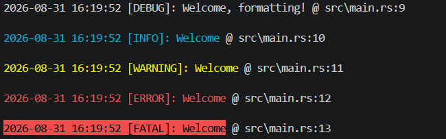

# TouchTrack Logger
A simple logger written in Rust.

---

## Using it

1. Import needed things
```rust
mod logger;
use std::fs::File;
use crate::logger::{internal_log, log_setoutfile, Levels};
```
Make sure to have this in your `Cargo.toml`:
```
[dependencies]
chrono = "0.4"
```

2. Create the main function
```rust
fn main() -> std::io::Result<()>
```

3. Create a file for saving the logs
```rust
let outputfile = File::create("log.txt")?;
log_setoutfile(outputfile);
```

4. Log here and do your program's things
```rust
log!(Levels::Debug, "Welcome{}", ", formatting!");
log!(Levels::Info, "Welcome");
log!(Levels::Warning, "Welcome");
log!(Levels::Error, "Welcome");
log!(Levels::Fatal, "Welcome");
```

Put your program logic here.

5. End the main function
```rust
Ok(())
```

## Reading it

### Reading from the file
```
2026-08-31 16:02:06 [DEBUG]: Welcome, formatting! @ src\main.rs:9
2026-08-31 16:02:06 [INFO]: Welcome @ src\main.rs:10
2026-08-31 16:02:06 [WARNING]: Welcome @ src\main.rs:11
2026-08-31 16:02:06 [ERROR]: Welcome @ src\main.rs:12
2026-08-31 16:02:06 [FATAL]: Welcome @ src\main.rs:13
```

Follows the structure:
```
TIME [LEVEL]: TEXT @ FILE:LINE
2026-08-31 16:02:06 [FATAL]: Welcome @ src\main.rs:13
```

The file gets written in another thread to not stop the execution of the program.

### Reading from terminal

Follows the same structure, but in terminal it's ANSI-coloured following this code:
```
DEBUG: white
INFO: cyan
WARNING: yellow
ERROR: red
FATAL: black (red background)
```

These colors are intended for easily recognizing the level, and making finding error messages, specially FATAL ones really easier.



## Flags

Use `log_setflag(k, v)` for setting a flag.

`debug` : If this flag is true, all debug messages will be show. Otherwise, they won't.  _Default: `"true"`_

`disk` : If this flag is true, log will be also saved at a file (needs log_setoutfile()). Otherwise, it won't.  _Default: `"true"`_

`ansi` : If this flag is true, terminal output will be ansi-coloured. Otherwise, it won't.  _Default: `"true"`_

`precise` : Shows the ms using format `H:M:S.ms`. _Default: `"false"`_

`datetime` : Shows the date and time. If false, they get hidden. _Default: `"true"`

`ignore` : Ignores the level and all below:
```
4 => ignores all
3 => all except fatal
2 => all except fatal and error
1 => all except fatal and error and warning
0 => shows all
```
This flag has no power over debug, which has it's own flag.

_Default: `"0"`_